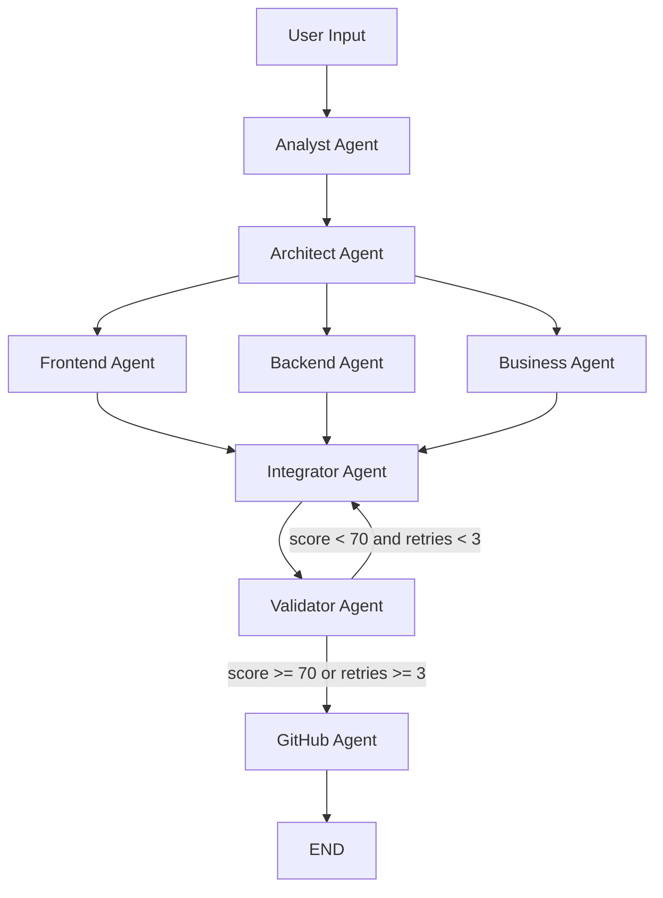

# HackFarmer 🌾


> A multi-agent AI system that generates complete hackathon projects from spec documents.

Upload a PDF or describe your hackathon project in text. Eight AI agents run in a directed graph (LangGraph) and produce:
- ✅ Working frontend + backend code
- ✅ A README
- ✅ A reveal.js pitch deck
- ✅ A Mermaid architecture diagram
- ✅ GitHub repo + ZIP download

> **Note:** This is an AI-generated project scaffold — not production battle-tested code. Use as a starting point for hackathons.

---

## Tech Stack

| Layer | Technology |
|-------|-----------|
| **Backend** | FastAPI + Python 3.11 |
| **BaaS** | Appwrite (Database, Auth, Storage, Realtime) |
| **Agents** | LangGraph (StateGraph) — 8 nodes |
| **LLM** | OpenAI SDK (unified — Gemini, Groq, OpenRouter) |
| **Auth** | Appwrite OAuth 2.0 (GitHub provider) |
| **Frontend** | React 18 + Vite + Tailwind CSS + Framer Motion |
| **Real-time** | SSE (Server-Sent Events) + Appwrite Realtime |
| **Automation** | n8n (optional, self-hosted) |

---

## Prerequisites

- **Node.js** 20+
- **Python** 3.11
- **Appwrite Cloud** account (or self-hosted Appwrite 1.5+)
- **GitHub OAuth App** configured in Appwrite Console
- At least one LLM API key: **Gemini**, **Groq**, or **OpenRouter**

---

## Setup Guide

### 1. Clone the repo

```bash
git clone https://github.com/talelboussetta/HackFarm.git
cd HackFarm
```

### 2. Create Appwrite collections

```bash
cd backend
pip install -r requirements.txt
python scripts/setup_appwrite.py
```

### 3. Configure GitHub OAuth in Appwrite Console

1. Go to **Auth → Settings → OAuth2 Providers**
2. Enable **GitHub**
3. Set your GitHub OAuth App credentials
4. Set the redirect URI to your frontend URL

### 4. Configure environment

```bash
# Backend
cp backend/.env.example backend/.env
# Fill in: APPWRITE_ENDPOINT, APPWRITE_PROJECT_ID, APPWRITE_API_KEY, FERNET_KEY

# Frontend
cp frontend/.env.local.example frontend/.env.local
# Fill in: VITE_APPWRITE_ENDPOINT, VITE_APPWRITE_PROJECT_ID
```

Generate a Fernet key:
```bash
python -c "from cryptography.fernet import Fernet; print(Fernet.generate_key().decode())"
```

### 5. Run with Docker

```bash
docker-compose up
```

Or run manually:

```bash
# Backend (terminal 1)
cd backend && python -m venv .venv && source .venv/bin/activate
pip install -r requirements.txt && python main.py

# Frontend (terminal 2)
cd frontend && npm install && npm run dev
```

---

## Architecture



---

## Agent Pipeline

| # | Agent | Role | Input | Output |
|---|-------|------|-------|--------|
| 1 | **Analyst** | Parse project spec, extract requirements | Raw text / PDF / DOCX | `project_name`, `mvp_features`, `constraints`, `domain` |
| 2 | **Architect** | Design system architecture | Analyst output | `tech_stack`, `api_contracts`, `component_map`, `database_schema` |
| 3 | **Frontend Agent** | Generate React frontend code | Architect output | `generated_files` (frontend/) |
| 4 | **Backend Agent** | Generate FastAPI backend code | Architect output | `generated_files` (backend/) |
| 5 | **Business Agent** | Generate README, pitch, diagram | Analyst + Architect output | `readme_content`, `pitch_slides`, `architecture_mermaid` |
| 6 | **Integrator** | Merge all code, resolve conflicts | All agent outputs | Merged `generated_files` |
| 7 | **Validator** | Score output quality (0–100) | All state | `validation_score`, `validation_issues` |
| 8 | **GitHub Agent** | Create repo, push code, build ZIP | All state | `github_url`, ZIP file in Appwrite Storage |

---

## API Reference

### Health
| Method | Endpoint | Description |
|--------|----------|-------------|
| `GET` | `/health` | Health check → `{"status": "healthy"}` |

### Jobs
| Method | Endpoint | Description |
|--------|----------|-------------|
| `GET` | `/api/jobs` | List user's jobs (newest first) |
| `POST` | `/api/jobs` | Create new job (multipart: `prompt` or `file`, `repo_name`, `repo_private`) |
| `GET` | `/api/jobs/{id}` | Get job details + agent runs |
| `DELETE` | `/api/jobs/{id}` | Cancel/delete a job |

### Settings
| Method | Endpoint | Description |
|--------|----------|-------------|
| `GET` | `/settings/keys` | List configured LLM providers (masked keys) |
| `POST` | `/settings/keys` | Add/update API key `{"provider": "gemini", "key": "..."}` |
| `DELETE` | `/settings/keys/{provider}` | Remove a provider key |
| `POST` | `/settings/keys/{provider}/test` | Test a stored key with live LLM call |

### Streaming
| Method | Endpoint | Description |
|--------|----------|-------------|
| `GET` | `/stream/{job_id}` | SSE stream of job events |

### Downloads
| Method | Endpoint | Description |
|--------|----------|-------------|
| `GET` | `/api/downloads/{job_id}` | Download generated ZIP |

---

## Deployment

### Backend → Heroku

```bash
cd backend
heroku create hackfarmer-api
heroku config:set APPWRITE_ENDPOINT=... APPWRITE_PROJECT_ID=... APPWRITE_API_KEY=... FERNET_KEY=... FRONTEND_URL=...
git push heroku main
```

### Frontend → Appwrite Sites

```bash
cd frontend
npm run build
appwrite deploy site --siteId <your-site-id> --path dist/
```

### CI/CD

The `.github/workflows/deploy.yml` handles automatic deploys on push to `main`.

---

## Troubleshooting

| Issue | Solution |
|-------|---------|
| **401 on API calls** | Ensure Appwrite session cookie is set. Login via frontend first. |
| **"No LLM providers"** | Go to Settings and add at least one API key (Gemini recommended). |
| **GitHub push fails** | Ensure user authenticated with GitHub OAuth scope including `repo` access. |
| **FERNET_KEY error** | Generate a new key: `python -c "from cryptography.fernet import Fernet; print(Fernet.generate_key().decode())"` |
| **Collections missing** | Run `python scripts/setup_appwrite.py` to create them. |
| **Pipeline hangs** | Check LLM API key validity. Try testing via Settings → Test Key. |

---

## Project Structure

```
HackFarm/
├── backend/
│   ├── src/
│   │   ├── api/          # FastAPI routes + dependencies
│   │   ├── agents/       # LangGraph agent nodes + state
│   │   ├── core/         # Config, encryption, events, queue
│   │   ├── store/        # (deprecated — Appwrite is BaaS)
│   │   ├── llm/          # LLM router + prompt templates
│   │   ├── ingestion/    # PDF/DOCX parsers + normalizer
│   │   └── integrations/ # GitHub API, n8n webhooks
│   ├── scripts/          # setup_appwrite.py, pre_deploy_check.py
│   └── tests/            # Phase 3A tests, E2E tests
├── frontend/
│   ├── src/
│   │   ├── pages/        # Route pages (Home, Job, History, Settings)
│   │   ├── components/   # React components
│   │   ├── hooks/        # Custom hooks (useJobStream, useAuth)
│   │   ├── store/        # Zustand state
│   │   ├── animations/   # Lottie JSON files
│   │   └── lib/          # API client, Appwrite config
│   └── Dockerfile
├── n8n/                  # n8n workflow exports
├── docker-compose.yml
└── .github/workflows/deploy.yml
```

---

## Contributing

1. Fork the repo
2. Create a feature branch: `git checkout -b feat/my-feature`
3. Commit your changes: `git commit -m "feat: add my feature"`
4. Push to the branch: `git push origin feat/my-feature`
5. Open a Pull Request

Please run `ruff check` and `pytest` before submitting.

---

## License

MIT
