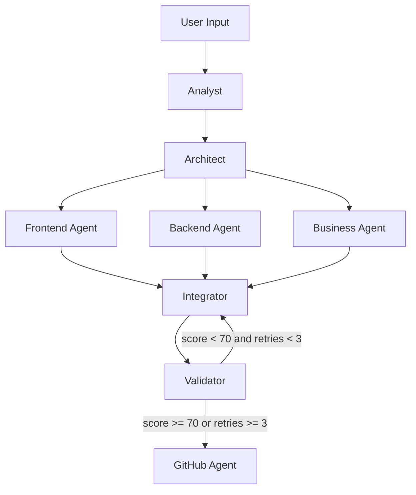

<p align="center">
  
</p>

<p align="center">
  <a href="https://github.com/talelboussetta/HackFarm/actions/workflows/deploy.yml"></a>
  
  
  
  
  
</p>

## Overview

HackFarmer is a multi-agent AI platform that transforms a project brief (text, PDF, or DOCX) into a full hackathon-ready codebase.  
It orchestrates specialized agents (analysis, architecture, code generation, integration, validation, publishing) using LangGraph and streams real-time progress to the UI.

## Key Features

- Multi-agent pipeline with live status graph
- Frontend + backend code generation from product specs
- Architecture diagram and business artifacts generation
- GitHub repository creation + iterative refine-and-push workflow
- Secure auth and per-user provider key management via Appwrite
- File browser and code preview for generated repositories

## Architecture



## Tech Stack

| Layer | Stack |
|---|---|
| Frontend | React 18, Vite, Tailwind CSS, Framer Motion |
| Backend | FastAPI, Python 3.11 |
| Orchestration | LangGraph |
| BaaS | Appwrite (Auth, DB, Realtime, Storage) |
| AI Providers | OpenAI-compatible routing (Gemini, Groq, OpenRouter, etc.) |
| Automation | n8n (optional) |

## Quick Start

### 1) Clone

```bash
git clone https://github.com/talelboussetta/HackFarm.git
cd HackFarm
```

### 2) Backend setup

```bash
cd backend
pip install -r requirements.txt
python scripts/setup_appwrite.py
```

### 3) Configure environment

```bash
# backend
cp backend/.env.example backend/.env

# frontend
cp frontend/.env.local.example frontend/.env.local
```

Generate a Fernet key:

```bash
python -c "from cryptography.fernet import Fernet; print(Fernet.generate_key().decode())"
```

### 4) Run locally

```bash
docker-compose up
```

## Core API

| Method | Endpoint | Purpose |
|---|---|---|
| GET | `/health` | Service health |
| GET | `/api/jobs` | List jobs |
| POST | `/api/jobs` | Create generation job |
| GET | `/api/jobs/{id}` | Job detail + runs |
| POST | `/api/jobs/{id}/refine` | Refine existing project |
| DELETE | `/api/jobs/{id}` | Cancel/delete job |

## Contributing

1. Fork the repository
2. Create a branch: `git checkout -b feat/your-change`
3. Commit: `git commit -m "feat: your change"`
4. Push and open a PR

Please run tests/lint checks relevant to your change before submitting.

## License

MIT
